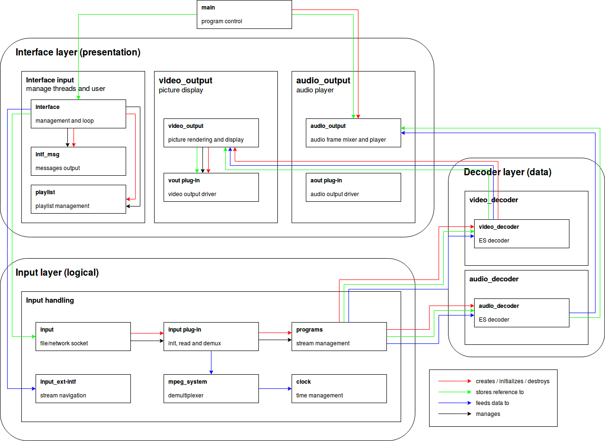

# EngSoft_TP1
Trabalho Prático 1 - Engenharia de Software 2 - Universidade Federal de Minas Gerais

<h2> Integrantes </h2>
  Breno Campos Ferreira Guimarães, César Augusto Moura Ferreira e João Paulo Martins Castanheira
  
<h2> Tópicos a serem tratados </h2>

1 - Descrição do sistema, incluindo principais features, objetivo, linguagem de programação.  
2 - Informações da equipe de desenvolvimento: principais desenvolvedores, funções na equipe (?)  
3 - Breve descrição da evolução do sistema: principais releases e novidades de cada uma.  
4 - Principais frameworks, ferramentas e linguagens usadas no desenvolvimento.  
5 - Documentação da arquitetura, na visão de "desenvolvimento" (modular), isto
é, principais módulos e suas responsabilidades, principais padrões de projeto
usados, justificativas para adoção dessa arquitetura etc. Se relevante,
documentar também visões de processo e física.  

<h3> 1 - Descrição, features, objetivos e linguagens de programação </h3>

O VLC é um software livre de código aberto, dedicado a reproduzir, tocar e transmitir multimídia. A sigla VLC deriva de "VideoLAN Client", nome abandonado devido a incorporação do programa servidor (VideoLAN Server) no software cliente. O sistema dá suporta para uma ampla variedade de formatos de vídeo, tais como: OGM, MPEG1, MPEG-2, MPEG-4, DivX, DVD, VCDs etc. Os formatos de áudio também têm suporte para  OGG, Speex, FLAC, MPC (Musepack), MP3, WAV e outros. Usando tecnologias e bibliotecas open source, o VLC foi compatibilizado com a maioria das plataformas existentes, incluindo GNU/Linux, Windows, Mac OS X, BSD, iOS e Android.

Além disso o VLC suporta vários protocolos de transmissão em redes, podendo ser usado como servidor de video/audio em uma rede de alta velicidade, suportando tanto o unicast quanto o multicast operados em IPv4 ou IPv6.

Pelo motivo de o VLC usar transmissão baseada em pacotes, ele não reproduz os vídeos completamente. Ele lida com arquivos incompletos, pacotes danificados e outras particularidades da transferência de pacotes via peer-to-peer network (P2P). Ele também reproduz arquivos m2t MPEG(.TS) enquanto eles ainda estão sendo digitalizados de uma câmera HDV através de um cabo FireWire, tornando possível o monitoramento do do vídeo enquanto ele está sendo reproduzido. O tocador também utiliza a biblioteca libcdio (Compact Disc Input and Control library) que contém recursos para acesso para o CD-ROM e imagens de CD, o que possibilita o acesso aos arquivos .iso e assim reproduzindo conteúde de uma imagem de disco, mesmo se o sistema operacional do usuário não suportar o manuseio direto de arquivos deste formato.

O VLC suporta todos os tipode de áudio e vídeo suportados pelas bibliotecas libavcodec e libavformat, isso significa que o VLC pode tocar vídeos H.264 ou MPEG-4 Parte 2 como também suportar arquivosdo formato FLV ou MXF usando a biblioteca FFmpeg. O software pode reproduzir gravações de alta definição de fitas D-VHS (Digital Video Recording), como também transmitir ao vivo através da conexão por cabo FireWire videos não criptografados de um hardware de armazenamento para um monitor HDTV.

O reprodutor pode executar um vídeo diretamente no papel de parede da área de trabalho do windows, usando o DirectX. Recurso disponível apenas para o windows. Além dissso o VLC também oferece um screencast, recurso que grava em vídeo as atividades mostradas no output padrão do sistema operacional. É possível também fazer a conversão de mídia para uma ampla gama de formatos suportados. Finalmente o programa pode ser instalado ou reproduzir diretamente de um USB flash drive ou outra unidade externa. O VLC tem o código fonte escrito na linguagem de programação C e sua GUI (Graphic User Interface), escrita em C++ (com Qt) e Objective-C.

<h3> 2 - Equipe de Desenvolvimento </h3>

  A equipe do VLC conta com atuais 444 contribuidores ativos no mundo todo. Porém muito mais pessoas são lembradas e agradecidas no arquivo [AUTHORS](https://github.com/videolan/vlc/blob/master/AUTHORS) no diretório raíz do projeto. Entre estes estão 596 programadores, 13 artistas, uma pessoa responsável pela documentação.
  
  Entre os desenvolvedores supracitados, esta é a lista dos mais relevantes e/ou ativos na lista de contribuidores do projeto no GitHub:
  
1. [jbkempf](https://github.com/jbkempf) - 6,701 commits / 463,234 ++ / 604,582 --
2. [fcartegnie](https://github.com/fcartegnie) - 3,576 commits / 165,082 ++ / 116,866 --
3. [fkuehne](https://github.com/fkuehne) - 3,253 commits / 1,905,039 ++ / 2,568,959 --
4. [funman](https://github.com/funman) - 3,030 commits / 1,223,256 ++ / 457,569 --
5. [ivoire](https://github.com/ivoire) - 1,909 commits / 29,626 ++ / 45,410 --
6. [hartman](https://github.com/hartman) - 1,637 commits / 163,943 ++ / 158,529 --
7. [jpsaman](https://github.com/jpsaman) - 1,618 commits / 109,116 ++ / 49,024 --
8. [antoinecellerier](https://github.com/antoinecellerier) - 1,597 commits / 648,531 ++ / 439,734 --
9. [tguillem](https://github.com/tguillem) - 1,490 commits / 70,725 ++ / 44,329 --
10. [chouquette](https://github.com/chouquette) - 849 commits / 17,260 ++ / 12,984 --

A equipe de desenvolvimento do VLC, como citado anteriormente é formada por desenvolvedores do mundo todo e especialmente ex-estudantes da universidade École Centrale Paris. Abaixo alguns dos contribuidores mais relevantes e suas respectivas responsabilidades:

Billy Biggs - Aprimoramentos em libdvdcss  
Sven Heithecker - Manutenção do cache para discos com conteúdo identico mas chaves diferentes.  
Samuel Hocevar - Código original de descriptografia CSS do VCL  
Eugenio Jarosiewicz - MacOS X DVD ioctls.  
Jon Lech Johansen - Porta Win32 e Manutenção na porta Darwin.  
KO Myung-Hun - Porta OS/2.  
Jean-Baptiste Kempf - Gerente  
Markus Kuespert - Porta BeOS do DVD ioctls  
Pascal Levesque - Porta QNX.  
Steve Lhomme - Melhorias em win32.  
Christophe Massiot - Ex gerente.  
Steven M. Schultz - Porta BSD/OS.  
Alex Strelnikov - Porta OS/2.  
German Tischler - Patch de entrada FreeBSD DVD.  
Gildas Bazin - Manutenções diversas na porta Win32.  

<h3> 3 - Evolução do sistema </h3>

O projeto VideoLan foi iniciado na universidade École Centrale Paris a qual relicenciou a VLC sobre a licensa GPLv2 em fevereiro de 2001. Desde então, o VLC obteve mais de dois bilhões de downloads. Porém o software teve seu início como um projeto acadêmico em 1996 e como já citado anteriormente, VLC costumava significar VideoLan Client quando a aplicação se resumia a um software puramente cliente. Mas como a aplicação já não é mais exclusivamente um cliente seu nome original não se aplica mais. A intenção consistia em um cliente e um servidor para realizar streaming de vídeo através de um satelite para uso no campus da universidade em Paris.

O software foi reescrito completamente em 1998, e foi lançado sobre a licença GNU General Public License no dia 1 de fevereiro de 2001, autorizado pela chefia da École Centrale Paris. A funcionalidade servidora da aplicação, VLS (Video Lan Server) foi praticamente toda absorvida pelo VLC e sua independência foi descontinuada. Portanto o nome da aplicação foi alterado para VLC media player, pois não existia mais uma extrutura de cliente servidor.

Em 2007 por motivos de incompatibilidade de licensas, os líderes do projeto decidiram por não adotar a recém lançada licensa GPLv3 (General Public License version 3). Após 13 anos de desenvolvimento, a versão 1.0.0 do VLC media player foi lançada no dia 7 de julho de 2009. Já a integração com os dispositivos móveis com sistema operacional Android, tiveram seus trabalhos iniciados em em 2010 e a partir do ano de 2011 já se fazia disponível para download na Google Play para tais smartphones. Já a integração do VLC media player com os aparelhos da Apple de sistema operacional iOS, teve a responsabilidade transferida para uma empresa chamada Applidium, que ficou responsável por compatibilizar o software para tais smartphones. Ainda sobre a GPLv2 os trabalhos foram concluídos e aceitos na Apple Store no mês de setembro de 2010. Entretanto em janeiro de 2011, após a reclamação formal de um desenvolvedor contribuidor do VLC Rémi Denis-Courmont a respeito de conflitos relacionados às politicas de licensiamento entre a GPLv2 e as políticas da Apple Store, o aplicativo foi retirado da Apple Store pela própria Apple. Consequentemente os autores do VLC, começaram os processos de relicensiamento do software em outubro de 2011 passando de GPLv2 para LGPLv2 (GNU Lesser General Public License) para alcançar melhor compatibilidade de licença perante a Apple. Foi então em julho de 2013 que aplicação VLC pode submeter novamente o software na iOS Apple Store sobre a Mozilla Public License.

A versão 2.0.0 do VLC media player foi lançada em 18 de fevereiro de 2012, uma versão para a Windows Store foi lançada em 13 de março de 2014. Suporte para Windows RT, Windows Phone e Xbox One foram posteriormente adicionadas ao software. Em 2016 a aplicação já ocupa a terceira posição no ranking em [SourceForge.net](https://sourceforge.net/) de softwares mais baixados, posição que ocupa até hoje com a impressionante marca de mais de dois bilhões de downloads.

A equipe de desenvolvimento já realizou 70.255 commits até hoje e o software continua evoluindo. Abaixo um gráfico com a relação de alterações em uma linha de tempo do programa.

A comunidade responsável já liberou dezenas de versões estaveis nesses 16 anos de existência da aplicação. Dentre elas, cinco foram consideradas notáveis pela documentação das releases do VLC.

1. Alterações importantes entre as versões 1.0.6 e 1.1.0:  

No Linux, os bugs conhecidos na biblioteca ALSA podem impedir a reprodução de áudio do programa. É então expressamente recomendada a atualização da biblioteca para a versão alsa-lib 1.0.24 ou superior.

O módulo de cache se moveu para ${libdir}/vlc/. Portanto a partir de agora o módulo pode ser gerado em tempo de instalação a não ser que você execute a 'staged installation '. Neste caso você pode gerar o módulo cache no seu script pós instalação, invocando o comando 'vlc-cache-gen'. Se o módulo cache não estiver presente e o VLC não puder escrever em ${libdir}/vlc/, resultara em um tempo excessivo para ligar o programa.

A maior parte dos plugins relacionados com X11 agora usam XCB ao invés de Xlib. VLC agora usa:
   - xproto,
   - xcb, xcb-shm, xcb-xv, xcb-randr (from libxcb),
   - xcb-keysyms (from xcb-utils),
   - x11-xcb (from libx11) - only for GLX support.
 * Em plataformas X11, uma versão de _trabalho_ de xdg-screensaver é tipicamente requerida para inibir o descanso de tela durante a execução de um vídeo.
 
 2. Alterações importantes entre as versões 1.1.13 e 2.0.0:  
 
O build padrão agora assume que o sistema operacional usa UTF-8 para os seus arquivos de sistema é conteúdo dos mesmos (com exceção da Windows port). Se isso é inaceitável, rode --enable-non-utf8 para configurar o script. Non-UTF-8 file systems support will be removed in future versions.

Os diretórios dos plugins do VLC podem ser sobrescritos, com a variável de ambiente VLC_PLUGIN_PATH. A opção do comando comando --plugin-path foi removida.

Os tarballs padrão agora são comprimidos usando XZ/LZMA: .tar.xz.

O suporte ao OSS não em compilado no Linux por padrão, rode --enable-oss no script de configuração se você usa o OSSv4 ou realmente deseja usar a emulação de OSS.

O plugin web foi movido para: git://git.videolan.org/npapi-vlc.git

 
 3. Alterações importantes entre as versões 2.0.9 e 2.1.0:  
 
As licensas de enúmeros módulos foram alteradas de GPLv2+ para LGPLv2.1+.

Suporte descontinuado para Macs baseados em PowerPC. VLC agora requer Mac OS X 10.6+

Em breve, os builds oficiais serão exculisavemten para arquiteturas 64bit.

As opções --with-tuning e --without-tuning serão removidas. Para personalizar a compilação para um tipo específico de processador, altere as CFLAGS manualmente.
 
 4. Alterações importantes entre as versões 2.1.6 e 2.2.0:  
 
Mais módulos tiveram suas licensas alteradas de GPLv2+ para LGPLv2.1+, notavelmente a maioria são de saída de streaming, multiplexadores e módulos de acesso ao output.
 
 5. Alterações importantes entre as versões 2.2.x e 3.0.0-git:  
 
O suporte para Windows XP/2003/2003R2 do VLC é agora baseado em "melhor-esforço". Deve funcionar, porém com limitações. O suporte para a biblioteca libVLC para Windows XP foi descontinuado. Você _realmente_ deveria atualizar.
   
 O Windows Vista (todas as versões) sem o Upgrade de Platform não é suportado.
 
 O suporte para o Linux, requer uma versão do Kernel superior a 2.6.26
 
 O suporte para o Mac OS X 10.6 foi removido. Você precisa do OS X 10.7 para rodar o VLC.

<h3> 4 - Frameworks, ferramentas e LPs </h3>

  A LibVLC é capaz de acessar dispositivos de captura, transcodificar e transmitir áudio e vídeo em diferentes protocolos. Permitindo que os desenvolvedores criem uma ampla gama de aplicações multimídia usando os recursos do VLC.
  
   Algumas vantagens do LibVLC:
     
   1. Diferentes métodos de entrada de vídeo;
   2. Stream de vídeo e áudio para Icecast2;
   3. Transcodificação entre formatos;
   4. Binding java de uso simplificado

  Algumas Desvantagens do LibVLC: 

1.Embora as LibVLC contenha as principais funcionalidades de captura e publicação de conteúdo, existem funções que a LibVLC atualmente não suporta, como o uso de filtros dinâmicos aplicados no conteúdo "on the fly" (overlay, texto sobre o vídeo, filtros de cor, etc).
    

Vlcj
	
O projeto VLCj fornece uma estrutura Java que permite uma instância de um player de mídia VLC nativo seja incorporada em uma Janela Java AWT ou Swing JFrame.Você obtém mais do que uma simples ligação, também obtém uma estrutura de nível superior que esconde muitas das complexidades de trabalhar com LibVLC.

Vlcj é desenvolvido principalmente e, portanto, amplamente testado em Linux - ele também funciona muito bem no Windows e MacOSX, embora possa haver algumas limitações no OSX.

Essa aplicação necessita de pelo menos o JDK 1.6.  Para o funcionamento perfeito e  sem alterações e necessario utilizar-se a JDK 1.7+.

A versão 3.0.0+ do vlcj requer a versão 2.1.0+ do VLC, versões anteriores do VLC não são suportadas e não funcionarão.A versão 3.0.0+ do vlcj requer a versão 3.5.2 do JNA. Alguns recursos da versão 3.0.0+ do vlcj (como a nova API do equalizador de áudio) exigem a versão 2.2.0+ do VLC. Se você ainda precisa usar VLC 2.0.x, então você deve permanecer com vlcj 2.x.x em vez de atualizar para a nova série vlcj 3.0.0.

   </img>
   
   
   
O fato do VLC ser um plataforma open Source, possibilita a escrita de diversos framework e ferramentas que auxiliam, na popularização dessa ferramenta e no seu desempenho para o usuário final. Para os desenvolvedores, o VLC é considerado um ótimo projeto de código aberto, e pode ser usado como base para outros projetos pessoais e empresariais. O VLC é uma ferramenta desenvolvida utilizando as linguagens de programação C em sua GUI (Graphic User Interface), C++ (com Qt) e Objective-C. 

A linguagem C, foi criada por Dennis Ritchie nos laboratórios da Bell Telephone em 1972. Essa linguagem  foi criada com um propósito: ser usada no desenvolvimento de uma nova versão do sistema operacional Unix. 
A linguagem C é considerada de propósito geral, ou seja é uma linguagem capaz de ser usada para praticamente qualquer tipo de projeto. É extremamente portável, ou seja um programa escrito em linguagem C pode ser facilmente usado em qualquer plataforma.

Outra característica que auxiliou na escolha de linguagem C, foi a sua eficácia. Os programas em C são pequenos e extremamente rápidos. Mais rápido que C, só em Assembly, programando direto no hardware. A compilação em C faz com que o programa ocorra em níveis bem próximos do hardware, otimizando bastante a execução dos programas.
Programadores em C tem o total controle e acesso aos recursos do computador e do sistema operacional, podendo acessar e lidar com áreas do sistema que simplesmente são inacessíveis com outras linguagens de programação, como Java ou C#.

Outra linguagem utilizado no desenvolvimento do VLC e C++ com QT. No VLC o Qt foi utilizado para desenvolver a interface gráfica da aplicação. O Qt é um framework multiplataforma para desenvolvimento de interfaces gráficas em C++, criado pela empresa norueguesa Trolltech. Com ele é possível desenvolver aplicativos e bibliotecas uma única vez e compilá-los para diversas plataformas sem que seja necessário alterar o código fonte. Essa característica, é fundamental para a produtividade dos programadores, que não vão ter que reescrever o código para as múltiplas plataformas e será possível manter a eficiência da aplicação, já que o QT e escrito em c++. 

Para a utilização de alguns plugins na plataforma IOS, foi necessário utilizar a linguagem Object-C para criar um wrapper, para que assim, fosse possível utilizar o VLC na plataforma IOS. 

Objective-C é um superconjunto da linguagem de programação C e fornece recursos orientados a objetos e um tempo de execução dinâmico. Objective-C herda a sintaxe, tipos primitivos e instruções de controle de fluxo de C e adiciona sintaxe para definir classes e métodos. Ele também adiciona suporte no nível de linguagem para o gerenciamento de gráfico de objetos e literais de objetos, ao mesmo tempo que fornece digitação e vinculação dinâmica, adiando muitas responsabilidades até o tempo de execução. 

<h3> 5 - Documentação da arquitetura </h3>

Apesar do uso da linguagem C, que em princípio não possui encapsulamento em
módulos/classes por padrão, o VLC Media Player foi projetado de modo a separar suas
principais funcionalidades em módulos bem definidos, com funcionalidades
"auto-contidas" e isoladas. O principal objetivo do desenvolvimento dessa
maneira é a separação de interesses, para que módulos e funcionalidades
distintos possam ser mantidos e atualizados de maneira independente.

Essa separação de interesses, além das vantagens típicas, possui dois pontos
adicionais de motivação para o contexto do VLC especificamente. Primeiramente,
o VLC é mantido e desenvolvido por um grupo de desenvolvedores
de tamanho considerável, sem que haja um nível alto de comunicação e
planejamento entre os mesmos. Logo, a separação em módulos facilita a
capacidade de desenvolvimento paralelo e "espalhado" de funcionalidades,
de modo que, contanto que as interfaces e as funcionalidades base (principalmente
relacionadas à libvlc) se mantenham estáveis, desenvolvedores independentes
podem contribuir de maneira isolada sem que a arquitetura e estabilidade
do software como um todo seja comprometida.

Porém, a principal motivação em particular do VLC vem da filosofia do seu projeto:
um dos seus maiores objetivos desde sua concepção é de que o player deve
ser extensível. Ou seja, é extremamente importante que novos desenvolvedores
possam implementar novas funcionalidades ou plugins, e acoplá-los ao
funcionamento padrão do VLC, de maneira simples e com baixa barreira de
entrada. Para tanto, a separação de módulos é primordial, pois ela garante
a minimização da interdependência entre seções do código distintas, e
incentiva o suporte à inclusão de novos módulos e plugins de maneira
simples e rápida.

Quanto aos componentes principais do funcionamento padrão do player, os mesmos
podem ser separados entre quatro grandes categorias: interface, input, decoders
e output. Os componentes de interface são os componentes de controle visíveis
ao usuário, de onde o software recebe comandos e arquivos de entrada. Os
componentes de input são os que tratam do processamento da entrada e da
lógica estrutural, como gerenciamento de clock, inicialização de plugins, etc.
Os componentes de decoding são os principais componentes funcionais, realizando
o processamento dos dados em si, e a geração dos dados de áudio e vídeo no formato
correto para que possam ser reproduzidos. Já os componentes de output cuidam
da apresentação dos dados decodificados para o usuário final.

Embora o VLC não siga nenhum modelo arquitetural rígido, sua arquitetura pode
ser vista como uma adaptação de modelos de camada típicos, como MVC ou de
aplicações em três camadas, separadas entre grandes módulos de objetivos
específicos. A figura abaixo mostra um diagrama com os principais grupos de
componentes e subcomponentes do VLC, separados entre seus interesses, com
as dependências entre componentes explicitadas. 

A partir da figura, é possível observar-se algumas das principais restrições
arquiteturais do projeto do VLC. Entre elas, destaca-se o fluxo principal de uso
do software, que se mantém consistente em todos os contextos de uso: inicia-se
com a interface, onde são lidos comandos de controle do usuário, que podem ser
fornecidos através de linha de comando ou da interface visual. Os comandos
são então direcionados aos componentes de input, que analisam a entrada e
inicializam as estruturas e funcionalidades necesssárias para o processamento
dos dados. O fluxo de controle é então passado aos decoders, que realizam a
computação mais "pesada" do player, decodificando o áudio e vídeo a serem
reproduzidos. O resultado da decodificação é então passado aos componentes
de output, que cuidam da exibição de mídia na interface visual.

É importante ressaltar que, apesar do fluxo de controle parecer simples e sequencial,
na grande maioria do tempo todos os componentes executam de maneira concorrente,
uma vez que o VLC faz uso extenso de multi-threading. A decodificação e a exibição
de output, por exemplo, são sempre realizadas em paralelo, independente de qual
tipo de entrada é fornecido. É possível também que o usuário forneça mais
arquivos de entrada para processamento enquanto já existem arquivos sendo
decodificados e exibidos, por exemplo, caracterizando portanto um cenário
onde todas as quatro "camadas" são executadas simultaneamente. 

Além disso, a figura também mostra um dos motivos pelo qual a arquitetura
do VLC não pode ser estritamente representada nos modelos de três camadas
típicos. Por exemplo, os módulos de decoding interagem diretamente com a
camada de interface, para a exibição do áudio/vídeo decodificados, sem
que haja intermediação de uma camada de modelo ou lógica. Dessa forma, a
arquitetura do VLC violaria os princípios arquiteturais desses modelos. Porém,
a estrutura descrita é intencional e faz parte do projeto original do player,
de modo que haja o mínimo de overhead possível entre a decodificação e a
exibição de output, maximizando a performance.
